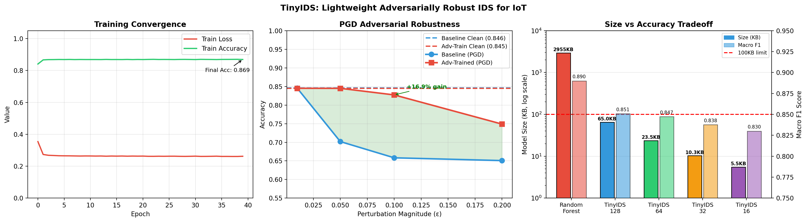

# TinyIDS: Adversarially Robust Intrusion Detection for Resource-Constrained IoT Devices

TinyIDS is a compact neural intrusion detection model built for microcontroller-class IoT hardware. Instead of compressing a large network after the fact, it is sized for deployment from the start. PGD adversarial training is part of the normal training loop, so hardening the model adds no parameters and no inference cost.

On the [IoT-23](https://www.stratosphereips.org/datasets-iot23) dataset, **TinyIDS-128** achieves:

| Metric | Value |
|---|---|
| Macro F1 | **0.85** |
| Parameters | 15,652 |
| ONNX size | **64.97 KB** |
| Inference latency | 0.40 ms |
| PGD robustness gain (ε = 0.10) | **+16.9 points** |

Compared with a 100-tree Random Forest baseline (macro F1 0.89, 2,955 KB, 31.75 ms), TinyIDS-128 keeps **95.5% of the F1** while being **45× smaller** and **80× faster**. Unlike the Random Forest, it can be adversarially trained.



---

## Model

A three-layer funnel MLP with BatchNorm before each activation, plus dropout:

```
36 features → Linear(h) → BN → ReLU → Dropout(0.3)
            → Linear(h/2) → BN → ReLU → Dropout(0.2)
            → Linear(h/4) → BN → ReLU
            → Linear(4)   → logits
```

Each width `h ∈ {16, 32, 64, 128}` is trained from scratch, not pruned down from the largest model. This gives a model family that can be matched to the target hardware:

| Variant | Params | Size (KB) | Latency (ms) | Macro F1 | Target hardware |
|---|---|---|---|---|---|
| TinyIDS-128 | 15,652 | 64.97 | 0.40 | 0.8507 | Raspberry Pi, Coral TPU |
| TinyIDS-64 | 5,268 | 23.51 | 0.36 | 0.8473 | ESP32-S3, STM32H7 |
| TinyIDS-32 | 1,996 | 10.28 | 0.26 | 0.8376 | ESP32, nRF52840 |
| TinyIDS-16 | 840 | 5.54 | 0.33 | 0.8300 | Arduino Nano, ESP8266 |
| TinyIDS-128 + PGD adv. training | 15,652 | 64.97 | 0.40 | 0.8434 | — |
| TinyIDS-128 + 30% L1 pruning | 15,652 | 64.97 | 0.29 | 0.8424 | — |
| Random Forest (baseline) | ~500K | 2,955.0 | 31.75 | 0.89 | — |

## Dataset and features

- **Source:** IoT-23 Zeek connection logs (Philips Hue, Amazon Echo, Somfy door lock infected with real malware).
- **Classes:** `Benign`, `PartOfAHorizontalPortScan`, `DDoS`, `Attack`. Classes that are not separable at the flow level (for example Okiru, which is indistinguishable from PortScan) are excluded.
- **Split:** stratified 80/20. The test set has 233,677 flows.
- **Features:** the raw Zeek fields plus 12 engineered ratio and rate features (`bytes_ratio`, `ip_bytes_ratio`, `pkts_ratio`, `orig_bytes_per_pkt`, `resp_bytes_per_pkt`, `bytes_per_sec`, `pkts_per_sec`, `total_bytes`, `total_pkts`, `resp_ratio`, `resp_pkt_ratio`, `header_ratio`), 36 features in total. The engineered features are clipped at the 99th percentile, and all features are standardised.
- **Class imbalance** (PortScan:Attack ≈ 211:1) is handled with a `WeightedRandomSampler` (class weight `1/n_c`).

## Adversarial robustness

White-box ℓ∞ attacks. Baseline TinyIDS-128 compared with the PGD-trained model:

| ε | PGD accuracy, baseline | PGD accuracy, adv. trained |
|---|---|---|
| clean | 0.846 | 0.845 |
| 0.01 | 0.846 | 0.845 |
| 0.05 | 0.702 | 0.845 |
| 0.10 | 0.658 | **0.827** |
| 0.20 | 0.651 | 0.749 |

- **Training:** each mini-batch is half clean and half PGD examples (ε = 0.05, α = 0.01, 7 steps, random start).
- **Evaluation:** PGD with 10 steps, α = 0.01. FGSM results are also computed for reference, but the FGSM baseline shows gradient masking at ε = 0.20.

---

## Repository structure

```
├── 01_prepare.py          # Load IoT-23, filter classes, engineer features, scale, split
├── 02_train.py            # Train baseline TinyIDS-128
├── 02b_adv_train.py       # Train PGD adversarially hardened TinyIDS-128
├── 03_evaluate.py         # Classification report, macro F1, confusion matrix
├── 04_adversarial.py      # FGSM / PGD attacks on baseline vs. hardened model
├── 05_compress.py         # Width-scaled variants, 30% pruning, ONNX export, latency
├── 06_figures.py          # Paper figures
├── paper_summary.py       # Prints the full results summary
├── verify_quantized.py    # Checks F1 of compressed / quantised models
├── check_separability.py  # Random Forest upper-bound / separability check
├── model.py               # TinyIDS architecture
├── utils.py               # Seed, pickle helpers
└── artifacts/             # Generated outputs (scaler, encoders, results, figures)
```

## Setup

Python 3.9+ is required.

```bash
pip install torch numpy pandas scikit-learn matplotlib seaborn tqdm onnx
```

A CUDA GPU is used if one is available. The experiments in the paper ran on an NVIDIA GTX 1660 Ti: baseline training took about 10 minutes, and adversarial training took about 18 minutes more.

### Data

The dataset is not included in this repository. Download the IoT-23 labelled Zeek `conn.log` files, combine them into one CSV, and save it as:

```
data/iot23_combined.csv
```

The CSV needs the standard Zeek columns (`duration`, `proto`, `service`, `orig_bytes`, `resp_bytes`, `conn_state`, `missed_bytes`, `orig_pkts`, `orig_ip_bytes`, `resp_pkts`, `resp_ip_bytes`, …) and a `label` column.

## Reproducing the results

Run the scripts in order from the repository root:

```bash
python 01_prepare.py      # → artifacts/X_scaled.npy, train.csv, test.csv, scaler/encoders
python 02_train.py        # → artifacts/tinyids_model.pt
python 02b_adv_train.py   # → artifacts/tinyids_adv_model.pt
python 03_evaluate.py     # → macro F1, artifacts/confusion_matrix.png
python 04_adversarial.py  # → artifacts/adversarial_results.pkl, adversarial_robustness.png
python 05_compress.py     # → artifacts/tinyids_h{128,64,32,16}.onnx, tinyids_pruned30.onnx
python 06_figures.py      # → artifacts/paper_figures.png, per_class_f1.png, compression_table.png
python paper_summary.py   # prints all results
```

Shared hyperparameters for all variants:

| Setting | Value |
|---|---|
| Optimiser | AdamW (lr 1e-3 baseline, 5e-4 adversarial; weight decay 1e-4) |
| Learning-rate schedule | Cosine annealing to 1e-5 over 40 epochs |
| Batch size | 2,048 |
| Gradient clipping | 1.0 |
| Early stopping | patience 8 |
| Seed | 42 |

## Limitations

- **Benign precision is 0.53.** At the flow level, low-rate probes look the same as routine device polling. The Random Forest has the same problem, so the cause is the feature space rather than model capacity.
- **Latency is measured on a host CPU.** Hardware-in-the-loop validation on real ESP32 and Arduino boards is future work.

**Future work:** INT8 quantisation-aware training, federated learning across devices, and multi-flow temporal features.

## Authors

- **Rishab P Nambiar** — Department of Mathematics, Amrita Vishwa Vidyapeetham, Coimbatore (rishabpnambiar@gmail.com)
- **P Kavitha** — Department of Mathematics, Amrita Vishwa Vidyapeetham, Coimbatore
